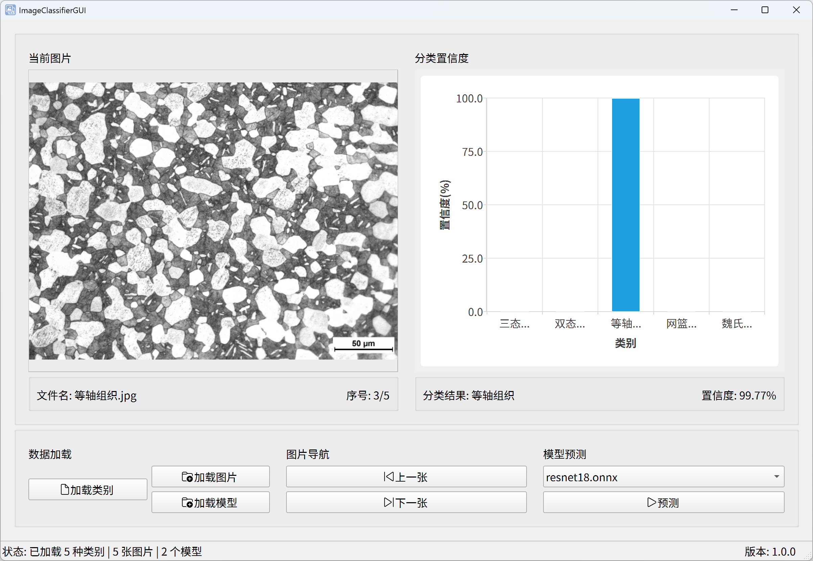

<div align="center">


<h1 align="center">ImageClassifierGUI</h1>

基于 PySide6 和 ONNX Runtime 的图像分类桌面应用

</div>

## 界面预览



## 功能特性

- MVC 架构
- 无 torch 依赖
- 支持批量导入图像文件、模型文件
- 支持分类结果可视化
- 支持状态栏

## 快速开始

### 1. 克隆仓库

```bash
git clone https://github.com/huang2fire/ImageClassifierGUI.git
```

### 2. 配置环境

推荐使用 [uv](https://github.com/astral-sh/uv) 进行依赖管理。

```bash
cd ImageClassifierGUI
uv sync
```

### 3. 运行项目

```bash
uv run main.py
# 或
python main.py
```

## 使用说明

应用配置文件位于 `config/app.toml`，可自定义界面风格、字体等参数。

应用支持的类别标签 JSON 文件的内容格式如下：

```json
{
    "0": "类别 0",
    "1": "类别 1",
    "2": "类别 2",
    "3": "类别 3",
    "4": "类别 4"
}
```

应用支持图像文件格式可在配置文件中定义：

```toml
[load]
image_extensions = ["*.bmp", "*.jpg", "*.jpeg", "*.png", "*.tif", "*.tiff"]
```

应用仅支持 ONNX 格式的模型文件。

## 许可证

本项目采用 MIT 许可证，详见 [LICENSE](LICENSE) 文件。
